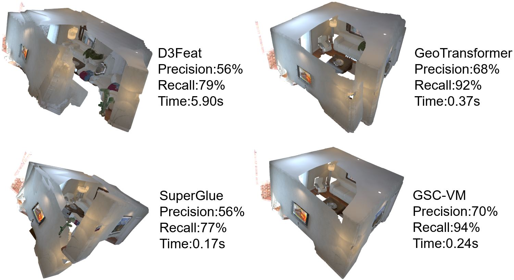

Pytorch implementation of SPVoteNet for paper "SPVoteNet: Registration of 3D Point Clouds with SuperPoint Votes"
This paper focus on outlier rejection for 3D point clouds registration. 

##Introduction
The point cloud data is a collection of unordered points, and the point cloud data of an object obtained in different ways has certain differences in density, number of points, and distance between points. In addition,the irregular structure of 3D point clouds leads to oversampling and undersampling in some areas. Point clouds are points distributed in space, which cannot be structured like pixels in images. Aboverall, the point cloud is an unordered, sparse, and unstructured set of vectors.Considering the characteristics of point clouds and the problems of related work,we adpot SPVoteNet to address the problems of 2D feature points without depth information, especially location information in 3D space, as well as the lack of massive data sets for 3D feature, and the problems of unordered, sparse and unstructured 3D feature acquisition. 
Step1. The key alignment feature pairs are extracted from the source and target color maps with superglue to get the coarse alignment of key point matching.
Step2. The key points obtained from step1 are converted from the pixel coordinate system to the camera coordinate system by using the depth camera parameter to get the key alignment feature pairs corresponding in the 3D point cloud, and then the alignment information of the feature points is voted by the distance and angle through the metric model to get the fine alignment of good point matching.
Step3.To use the good point matching fine alignment obtained from step2 for point cloud registration
Our proposed SPVoteNet also works best in industrial applications of 3D Reconstruction.

##Installation
See requirements.txt. 
code has been tested with Ubuntu 20.04,GCC 7.5.0，python 3.8.0,PyTorch 1.7.1+cu110，CUDA11.0.

Pre-trained Weights
We provide pre-trained weights superglue_indoor.pth in the SPVoteNet folder.

The code is heavily borrowed from [SuperGlue](https://github.com/magicleap/SuperGluePretrainedNetwork) and [External-Attention](https://github.com/xmu-xiaoma666/External-Attention-pytorch)
##DATASET
The dataset can be downloaded from https://3dmatch.cs.princeton.edu/ .
You can use your dataset as TUM format. We also provide a simple example of TUM format.
The demo data are provided by [BaiDuPan](https://pan.baidu.com/s/1M97myAn5iYDa1V49FJU2xA)  Extraction Code: 1234

##Demo
We provide a small demo to register them using SPVoteNet. The data files are saved in the demo_data folder, which can be replaced by your own data. 
1. two-view 3D point cloud reconstruction by SPVoteNet.
    1.1 When testing the 3DMATCH dataset (point cloud files are needed, automatic point cloud file generation requires changes to the program).
        1.1.1 overall test: first put the 3DMATCH dataset into the tum-data folder, put the document ply_to_png into the living_room_png folder.
            modify the path, etc., run main_living_all.py for registration.
        1.1.2 Two point clouds registration: the same as above to place the data set, etc., modify, run main_living_one.py
    Note: the txt generated by superglue is stored in the textliving folder, which can be modified by match2WZH_living.py
    1.2 Test tum dataset, no point cloud file, need rgb image and depth image, first put adjust.py into rgb folder, run to generate remove none depth points
        1.2.1 Overall test: modify the correspondence, and run main_tums.py
        1.2.2 Two point clouds test: same as above, run main_tums_one.py
        Note: the txt generated by superglue is stored in the textliving folder, which can be modified by match2WZH_TEST.py
        The images are stored in imgtest, the txt in txttest
2. splice livingroom dataset by icp: splice all point clouds: icp.py, splice two point clouds: icp_one.py
notes:
Hypothesis.py performs fine alignment of all 20 pairs of points in the test folder that have been coarsely aligned with superGlue.
FilterNet.py to train the neural network 
pcd.py Generate point clouds using rgb and depth maps
If Voting result is: {0: 1, 1: 1, 2: 1, 3: -1, 4: -1, 5: -1, 6: -1, 7: -1, 8: -1, 9: -1}, then the index of the number of votes from smallest to largest is: [3, 4, 5, 6, 7, 8, 9, 0, 1, 2]
If you will to evaluate D3Feat,please install the [D3Feat](https://github.com/XuyangBai/D3Feat), and see evaluation/D3Feat/readme.md.
If you will to evaluate PointDSC,please install the [PointDSC](https://github.com/XuyangBai/PointDSC), and see evaluation/PointDSC/readme.md .
If you will to evaluate GeoTransformer,please install the [GeoTransformer](https://github.com/qinzheng93/GeoTransformer),and see evaluation/GeoTransformer/readme.md.
If you will to evaluate ICP,please see Hypothesis.py
## References

[1] 3DMatch: Learning Local Geometric Descriptors from RGB-D Reconstructions, Andy Zeng, Shuran Song, Matthias Nießner, Matthew Fisher, Jianxiong Xiao, and Thomas Funkhouser, CVPR 2017.

[2] Superglue: Learning feature matching with graph neural networks, in Proceedings of the IEEE/CVF conference on computer vision and pattern recognition, 2020.

[3] Beyond self-attention: External attention using two linear layers for visual tasks, IEEE Transactions on Pattern Analysis and Machine Intelligence, 2022.
